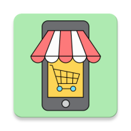

# EasyShop App

<p align="center">
  
</p>
Welcome to EasyShop, the ultimate companion for your supermarket shopping needs.

With EasyShop, we aim to revolutionize the way you create and manage your shopping lists.

Say goodbye to the hassle of forgetting items or struggling with paper lists.

Our app provides a seamless and intuitive experience, ensuring that your supermarket visits are efficient, organized, and enjoyable.

Watch the video demonstration on [YouTube](https://youtu.be/qULSS-Dh-RA).

## Features
### 1. User Authentication
Users can register an account with their email and password. Existing users can log in to access their accounts.
### 2. Create List
In the "Create List" section, users can choose a category and select items within that category. 

For each item, users can specify the quantity they need. The app will display the selected items with updated quantities and prices.

Once you have finished selecting the items in a category, you can save them to your personal list.

Saving the selected items ensures that your list is readily accessible across devices and persists even when switching accounts.

To save the selected items into your constant list, simply click the "Save to My List" button. 
### 3. My List
The "My List" section offers a comprehensive view of your saved constant list. 

Your list is securely stored in real-time using Firebase, ensuring accessibility across devices and persisting even when switching accounts. 

Need to remove an item? No problem! Simply click on it to delete it from your list.
### 4. Map - Nearby Supermarkets
Navigate your way to nearby supermarkets with the interactive "Map" feature.

The app displays supermarkets in your vicinity on a user-friendly Google Map. 

Each supermarket is marked, allowing you to quickly identify the nearest options. 

Clicking on a marker reveals the supermarket's name, and with a single tap, you can seamlessly launch Google Maps for step-by-step navigation.


## Installation
1. Clone the repository:
```bash
git clone https://github.com/AdiFinkelman/EasyShop.git
```

2. Build and run the application on your preferred Android mobile platform.

## Technologies Used
Android Studio: A powerful integrated development environment (IDE) for building Android applications using Java.

Java: A widely-used programming language known for its versatility and object-oriented approach.

Firebase: A reliable cloud-based platform for real-time data storage and synchronization.

Google Maps API: Harness the capabilities of Google Maps to display nearby supermarkets and provide seamless navigation.

## Contributing
Contributions are welcome! If you encounter any issues or have suggestions for improvements, please open an issue or submit a pull request on the project's GitHub repository.

## License
This project is licensed under the MIT License. You are free to modify and distribute this application as per the terms of the license.

Note: The provided source code does not include a valid Google API key. It is essential to obtain your own API key from the Google Cloud Platform console to utilize the Google Maps API functionality

## Contact
If you have any questions or need further assistance, please contact the project maintainer:

Name: Adi Finkelman
Email: [adifi436@gmail.com]

Feel free to reach out with any inquiries related to the EasyShop App.
